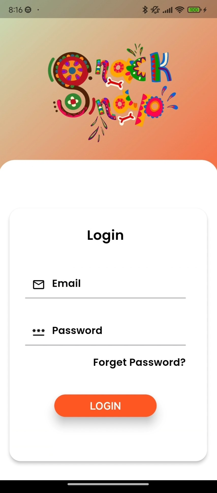
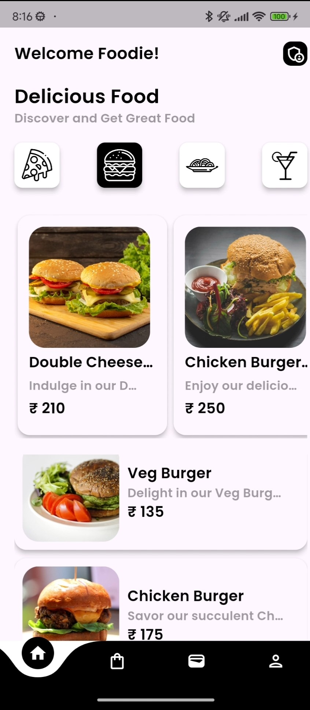
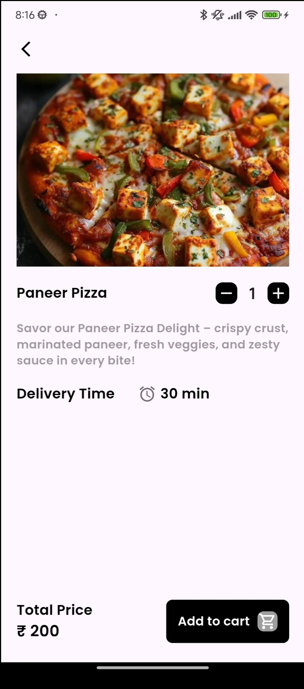
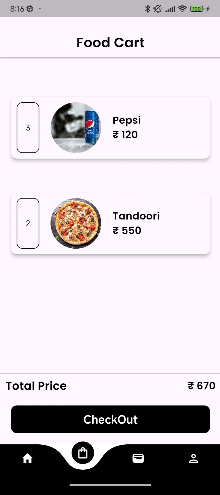
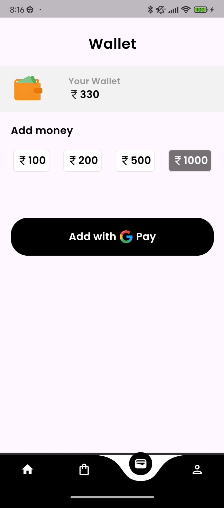
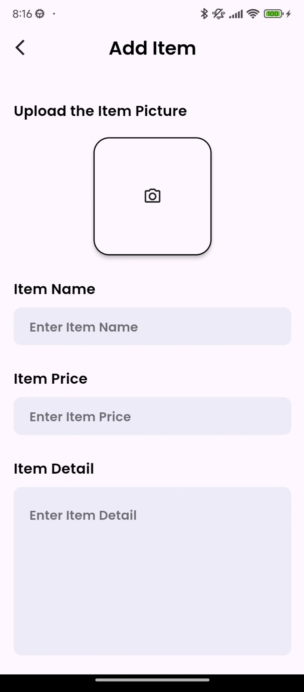

# Food Delivery App

## Overview
The food delivery app provides a seamless and user-friendly experience for ordering food. It’s built using **Flutter** for cross-platform development and **Firebase** for backend services like user authentication and real-time database management. The app also integrates **UPI payment** for quick and secure transactions.

## Screenshots

  
  
  
  
  

  
  
  
  

## Key Features

### Onboard Screen 🚀
- A series of introductory screens to guide users through the app's features and benefits.

### Signup and Login 🔑
- User registration with email and password.
- Login functionality for returning users.
- Password reset via email.

### Changing Password 🔄
- Users can change their password via email.

### Home Screen 🏠
- Display a list of available food items.

### Profile Section 👤
- Users can update their profile photo.

### Cart 🛒
- Add and manage food items in the cart.
- Calculate total cost and prepare for checkout.

### Wallet 💳
- Implement a wallet feature where users can add funds and use them for orders via **UPI payment**.

### User and Admin Section 🧑‍🤝‍🧑
- Separate interfaces for regular users and admin users.
- Admin can manage by adding new items to the menu.

## Technologies Used
- **Flutter**: For building the cross-platform app.
- **Firebase**: For authentication and real-time database management.
- **UPI**: For secure and convenient payment processing.